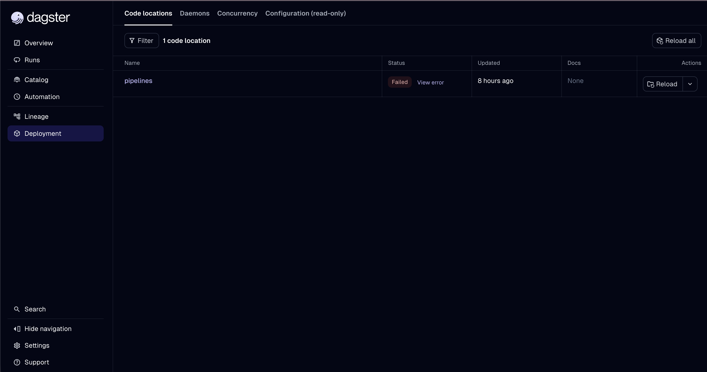
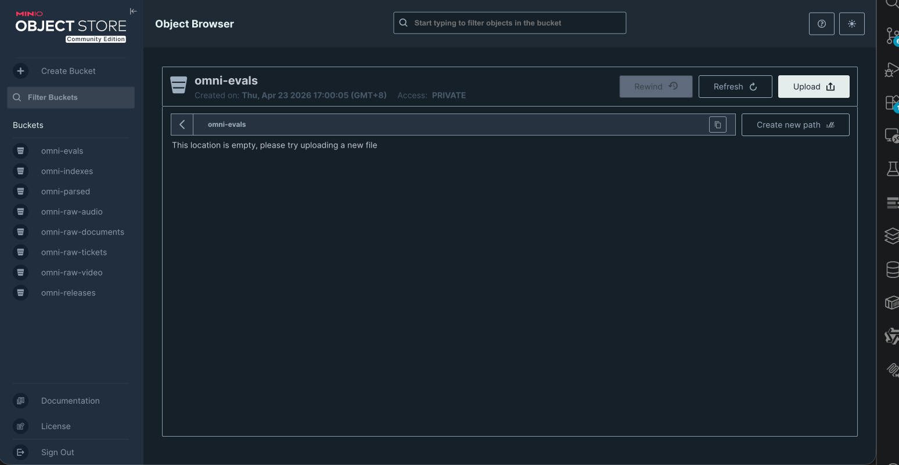
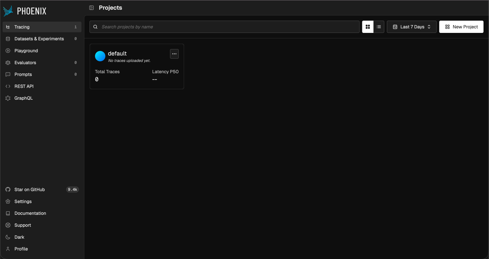

## 实验
### 0. 基线
 + **本周实验目标**
	+ 把基础设施、目录、服务入口、最小 seed 数据、seed loader、contract tests、RAG 冒烟查询和 release 检查这条最小链路拉通。
+ **本周不做什么**
	+ 不是做出完整的项目，不会填入具体的关于数据契约、采集与入湖、RAG API、Tool Layer、观测和发布等等的内容。
+ **准备验证哪些服务和文件**
	+ 验证`docker compose`正常启动所有服务，并通过健康状态检查。
	+ 验证`seed`, `seed loader`,`contract tests`正常运行。
	+ 执行`RAG冒烟查询`和`release检查`。
### 1. 环境信息
+ 通过`git clone`将项目克隆到本地 `/Users/peilin.yuan/Documents/code/omnisupport-copilot`。
+ 使用版本为`e03c32c (HEAD -> main, origin/main, origin/HEAD) Update lakehouse_runbook.md`。
+ `.env.local`已创建，并在本地进行了代码修改，使`rag_api`使用阿里云百炼的apikey。
### 2. 执行命令
```bash
NAME                  IMAGE                                         COMMAND                   SERVICE          CREATED          STATUS                    PORTS
omni_dagster          dagster/dagster-k8s:latest                    "dagster dev -h 0.0.…"   dagster          23 hours ago     Up 23 hours               0.0.0.0:3000->3000/tcp, [::]:3000->3000/tcp
omni_minio            minio/minio:latest                            "/usr/bin/docker-ent…"   minio            22 hours ago     Up 22 hours (healthy)     0.0.0.0:9000->9000/tcp, [::]:9000->9000/tcp, 0.0.0.0:10011->9001/tcp, [::]:10011->9001/tcp
omni_otel_collector   otel/opentelemetry-collector-contrib:latest   "/otelcol-contrib --…"   otel_collector   23 hours ago     Up 23 hours               0.0.0.0:4317-4318->4317-4318/tcp, [::]:4317-4318->4317-4318/tcp, 0.0.0.0:8889->8889/tcp, [::]:8889->8889/tcp, 55679/tcp
omni_phoenix          arizephoenix/phoenix:latest                   "/usr/bin/python3.13…"   phoenix          23 hours ago     Up 23 hours               4317/tcp, 9090/tcp, 0.0.0.0:6006->6006/tcp, [::]:6006->6006/tcp
omni_postgres         pgvector/pgvector:pg16                        "docker-entrypoint.s…"   postgres         23 hours ago     Up 23 hours (healthy)     5432/tcp
omni_rag_api          infra-rag_api                                 "uvicorn app.main:ap…"   rag_api          35 minutes ago   Up 35 minutes (healthy)   0.0.0.0:8000->8000/tcp, [::]:8000->8000/tcp
omni_tool_api         infra-tool_api                                "uvicorn app.main:ap…"   tool_api         23 hours ago     Up 23 hours (healthy)     0.0.0.0:8001->8001/tcp, [::]:8001->8001/tcp
```
### 3. 关键截图
+ **dagster - ✅**

+ **MinIO Console - ✅**

+ **Phoenix - ✅**

### 4. 健康检查结果
+ **RAG API - ✅**
```bash
╰─ curl -s http://localhost:8000/health
{"status":"ok","service":"rag_api","version":"0.1.0","release_id":"dev-local","checks":{"api":"ok","database":"ok","vector_index":"pending","llm":"pending"}}
```
+ **Tool API - ✅**
```bash
╰─ curl -s http://localhost:8001/health
{"status":"ok","service":"tool_api","version":"0.1.0","release_id":"dev-local"}
```
### 5. seed数据生成结果
+ **文件生成路径**
```bash
./data/canonization/tickets/tickets-seed-001.jsonl
```
+ **数据样例**
```json
{"ticket_id": "TKT-20260318-000001", "schema_version": "ticket_v1", "source_id": "structured:tickets:seed_batch_001", "ingest_batch_id": "batch-20260331-001", "customer_id": "cust-619157e0b3b29a44", "org_id": "org-7f9bf3dbdfc79052", "status": "open", "priority": "p4_low", "category": "installation", "product_line": "northstar_studio", "product_version": "1.5.0", "subject": "Silent install returns exit code 1", "description": "Customer from Crest Digital reports: Silent install returns exit code 1. Affecting Northstar Studio v1.5.0.", "error_codes": ["ST-SCHED-005", "ST-FLOW-001"], "asset_ids": [], "assignee_id": null, "sla_tier": "professional", "sla_due_at": "2026-03-18T18:44:21.898209+00:00", "created_at": "2026-03-18T10:44:21.898209+00:00", "updated_at": "2026-03-18T10:44:21.898209+00:00", "resolved_at": null, "pii_level": "low", "pii_redacted": false, "quality_gate": "pass", "owner": "course-team", "tags": ["northstar_studio", "installation", "p4_low"]}

{"ticket_id": "TKT-20260416-000002", "schema_version": "ticket_v1", "source_id": "structured:tickets:seed_batch_001", "ingest_batch_id": "batch-20260331-001", "customer_id": "cust-2c014a25fe9e12fb", "org_id": "org-6227c5ea9810c2d2", "status": "open", "priority": "p3_medium", "category": "configuration", "product_line": "northstar_workspace", "product_version": "3.2.0", "subject": "Custom webhook endpoint not receiving events", "description": "Customer from Apex Solutions reports: Custom webhook endpoint not receiving events. Affecting Northstar Workspace v3.2.0.", "error_codes": ["WS-QUOTA-006", "WS-WEBHOOK-005"], "asset_ids": [], "assignee_id": null, "sla_tier": "standard", "sla_due_at": "2026-04-17T16:44:21.898209+00:00", "created_at": "2026-04-16T16:44:21.898209+00:00", "updated_at": "2026-04-16T16:44:21.898209+00:00", "resolved_at": null, "pii_level": "low", "pii_redacted": false, "quality_gate": "pass", "owner": "course-team", "tags": ["northstar_workspace", "configuration", "p3_medium"]}

{"ticket_id": "TKT-20260313-000003", "schema_version": "ticket_v1", "source_id": "structured:tickets:seed_batch_001", "ingest_batch_id": "batch-20260331-001", "customer_id": "cust-548917c0c622e5be", "org_id": "org-1c8537598ddac600", "status": "in_progress", "priority": "p4_low", "category": "billing", "product_line": "northstar_edge_gateway", "product_version": "FW-2.2.5", "subject": "Question about Northstar Edge Gateway pricing for additional seats", "description": "Customer from Summit Analytics reports: Question about Northstar Edge Gateway pricing for additional seats. Affecting Northstar Edge Gateway vFW-2.2.5.", "error_codes": ["EG-FW-002"], "asset_ids": [], "assignee_id": null, "sla_tier": "enterprise", "sla_due_at": "2026-03-13T15:44:21.898209+00:00", "created_at": "2026-03-13T11:44:21.898209+00:00", "updated_at": "2026-03-13T11:44:21.898209+00:00", "resolved_at": null, "pii_level": "low", "pii_redacted": false, "quality_gate": "pass", "owner": "course-team", "tags": ["northstar_edge_gateway", "billing", "p4_low"]}
```
### 6. seed loader 报告
```txt
============================================================
  SEED LOADER RUN REPORT
============================================================
  Batch ID    : batch-20260424-auto
  Dry Run     : True
  Manifests   : 4 valid, 0 rejected
  Assets      : 12 total, 10 accept, 1 warn, 1 quarantine, 0 reject
  ✓ manifest-edge-gateway-pdf-20260331-001 [document] (accept=3, warn=0, quarantine=0, reject=0)
      ACCEPT     doc:edge:000000000001 -> omni://contracts/data/doc_asset/v1
      ACCEPT     doc:edge:000000000002 -> omni://contracts/data/doc_asset/v1
      ACCEPT     doc:edge:000000000003 -> omni://contracts/data/doc_asset/v1
  ✓ manifest-tickets-synthetic-20260331-001 [structured] (accept=2, warn=0, quarantine=0, reject=0)
      ACCEPT     structured:tickets:seed_batch_001 -> omni://contracts/data/ticket/v1
      ACCEPT     structured:tickets:msdialog_sample -> omni://contracts/data/ticket/v1
  ✓ manifest-week02-practice-20260420-001 [structured] (accept=1, warn=1, quarantine=1, reject=0)
      ACCEPT     structured:tickets:practice_ok -> omni://contracts/data/ticket/v1
      WARN       structured:tickets:practice_warn -> omni://contracts/data/ticket/v1
      QUARANTINE structured:tickets:practice_quarantine -> omni://contracts/data/ticket/v1
  ✓ manifest-workspace-helpcenter-20260331-001 [document] (accept=4, warn=0, quarantine=0, reject=0)
      ACCEPT     doc:workspace:000000000001 -> omni://contracts/data/doc_asset/v1
      ACCEPT     doc:workspace:000000000002 -> omni://contracts/data/doc_asset/v1
      ACCEPT     doc:workspace:000000000003 -> omni://contracts/data/doc_asset/v1
      ACCEPT     doc:workspace:000000000004 -> omni://contracts/data/doc_asset/v1
============================================================
```
### 7.  contract tests 结果
```bash
tests/contract/test_json_schemas.py::test_contract_file_exists[schema_path0] PASSED [  2%]
tests/contract/test_json_schemas.py::test_contract_file_exists[schema_path1] PASSED [  5%]
tests/contract/test_json_schemas.py::test_contract_file_exists[schema_path2] PASSED [  8%]
tests/contract/test_json_schemas.py::test_contract_file_exists[schema_path3] PASSED [ 11%]
tests/contract/test_json_schemas.py::test_contract_file_exists[schema_path4] PASSED [ 14%]
tests/contract/test_json_schemas.py::test_contract_file_exists[schema_path5] PASSED [ 17%]
tests/contract/test_json_schemas.py::test_contract_file_exists[schema_path6] PASSED [ 20%]
tests/contract/test_json_schemas.py::test_contract_file_exists[schema_path7] PASSED [ 22%]
tests/contract/test_json_schemas.py::test_contract_file_exists[schema_path8] PASSED [ 25%]
tests/contract/test_json_schemas.py::test_data_contract_is_valid_json[schema_path0] PASSED [ 28%]
tests/contract/test_json_schemas.py::test_data_contract_is_valid_json[schema_path1] PASSED [ 31%]
tests/contract/test_json_schemas.py::test_data_contract_is_valid_json[schema_path2] PASSED [ 34%]
tests/contract/test_json_schemas.py::test_data_contract_is_valid_json[schema_path3] PASSED [ 37%]
tests/contract/test_json_schemas.py::test_ticket_contract_required_fields PASSED [ 40%]
tests/contract/test_json_schemas.py::test_tool_contract_required_fields[tool_path0] PASSED [ 42%]
tests/contract/test_json_schemas.py::test_tool_contract_required_fields[tool_path1] PASSED [ 45%]
tests/contract/test_json_schemas.py::test_tool_contract_required_fields[tool_path2] PASSED [ 48%]
tests/contract/test_json_schemas.py::test_tool_audit_fields_complete[tool_path0] PASSED [ 51%]
tests/contract/test_json_schemas.py::test_tool_audit_fields_complete[tool_path1] PASSED [ 54%]
tests/contract/test_json_schemas.py::test_tool_audit_fields_complete[tool_path2] PASSED [ 57%]
tests/contract/test_json_schemas.py::test_release_manifest_example_valid PASSED [ 60%]
tests/contract/test_json_schemas.py::test_seed_manifests_structure PASSED  [ 62%]
tests/contract/test_json_schemas.py::test_seed_manifests_validate_against_schema PASSED [ 65%]
tests/contract/test_week02_gate.py::test_week02_valid_fixture_records_pass_current_contracts[ticket] PASSED [ 68%]
tests/contract/test_week02_gate.py::test_week02_valid_fixture_records_pass_current_contracts[document] PASSED [ 71%]
tests/contract/test_week02_gate.py::test_week02_valid_fixture_records_pass_current_contracts[audio] PASSED [ 74%]
tests/contract/test_week02_gate.py::test_week02_valid_fixture_records_pass_current_contracts[video] PASSED [ 77%]
tests/contract/test_week02_gate.py::test_week02_invalid_fixture_records_fail_contracts[ticket_missing_priority-ticket] PASSED [ 80%]
tests/contract/test_week02_gate.py::test_week02_invalid_fixture_records_fail_contracts[document_bad_fingerprint-document] PASSED [ 82%]
tests/contract/test_week02_gate.py::test_week02_invalid_fixture_records_fail_contracts[audio_missing_pii_redacted-audio] PASSED [ 85%]
tests/contract/test_week02_gate.py::test_week02_invalid_fixture_records_fail_contracts[video_bad_enum-video] PASSED [ 88%]
tests/contract/test_week02_gate.py::test_week02_practice_manifest_validates_against_schema PASSED [ 91%]
tests/contract/test_week02_gate.py::test_week02_manifest_validator_rejects_incremental_cursor_without_cursor_field PASSED [ 94%]
tests/contract/test_week02_gate.py::test_week02_seed_loader_emits_gate_judgments_and_report PASSED [ 97%]
tests/contract/test_week02_gate.py::test_seed_loader_can_limit_run_to_explicit_manifest_paths PASSED [100%]

===================== warnings summary =====================
tests/contract/test_week02_gate.py::test_week02_valid_fixture_records_pass_current_contracts[ticket]
tests/contract/test_week02_gate.py::test_week02_valid_fixture_records_pass_current_contracts[document]
tests/contract/test_week02_gate.py::test_week02_valid_fixture_records_pass_current_contracts[audio]
tests/contract/test_week02_gate.py::test_week02_valid_fixture_records_pass_current_contracts[video]
tests/contract/test_week02_gate.py::test_week02_invalid_fixture_records_fail_contracts[ticket_missing_priority-ticket]
tests/contract/test_week02_gate.py::test_week02_invalid_fixture_records_fail_contracts[document_bad_fingerprint-document]
tests/contract/test_week02_gate.py::test_week02_invalid_fixture_records_fail_contracts[audio_missing_pii_redacted-audio]
tests/contract/test_week02_gate.py::test_week02_invalid_fixture_records_fail_contracts[video_bad_enum-video]
  /usr/local/lib/python3.11/site-packages/jsonschema/validators.py:1326: DeprecationWarning: The metaschema specified by $schema was not found. Using the latest draft to validate, but this will raise an error in the future.
    cls = validator_for(schema)
-- Docs: https://docs.pytest.org/en/stable/how-to/capture-warnings.html
=============== 35 passed, 8 warnings in 0.13s ============
```
+ **warning 产生原因为测试数据缺少了一些信息或某字段值有误**
	+ `ticket` : `missing_priority`
	+ `document`:`bad_fingerprint`
	+ `audio`: `missing_pii_redacted`
	+ `video`: `bad_enum`
### 8. query / release 响应摘要
```bash
╰─ curl -s -X POST http://localhost:8000/api/v1/query \
  -H "Content-Type: application/json" \
  -d '{"query": "如何配置 Northstar Workspace SSO？"}'
{"answer":"当前知识库未找到与您问题相关的内容，建议创建工单由支持团队处理。","citations":[],"evidence_ids":[],"retrieved_chunks":[],"confidence":0.0,"answer_grounded":false,"release_id":"dev-local","trace_id":"b7935355-a8ad-4bc1-947a-f179f6d589a3","session_id":null}%

╰─ curl -s http://localhost:8000/api/v1/admin/release
{"release_id":"dev-local","data_release_id":"data-v0.0.1","index_release_id":"index-v0.0.1","prompt_release_id":"prompt-v0.0.1"}
```
### 9. 失败项 / 修复动作 / 待补事项
+ **失败项**: 无
+ **修复动作**: 无
+ **待补事项**: 从week02起，逐层填入内容，完善整个项目